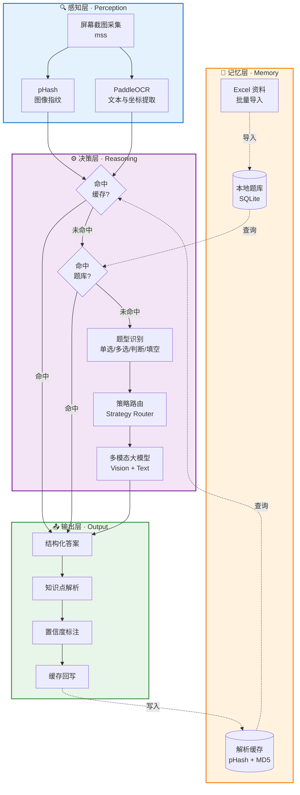

# VisionQuiz Assistant · 多模态题目智能解析 Agent

> 基于视觉大模型 + OCR 的通用题目理解工具，面向**个人学习、培训复习、题库内容生成、教育辅助**场景。
> 通过截图输入，自动识别题型、定位题干与选项、生成答案解析与知识点讲解。
> 支持任意兼容 OpenAI 格式的多模态模型自由切换。

---

## 🎯 项目定位

传统题目处理工具往往深度绑定某一特定平台的 DOM 结构或固定坐标，换个界面就完全失效。
本项目采用 **"视觉大模型 + OCR"** 的 Agent 架构，不依赖任何特定平台结构，
实现**跨界面、跨样式的通用题目理解**，核心价值在于：

- **学习辅助**：学生/职场人自学时快速获得题目解析与知识点讲解
- **题库生成**：将历史资料、扫描件批量转换为结构化题库 + 标准解析
- **培训复习**：个人复习阶段对照讲解，定位薄弱知识点
- **教育内容处理**：教师/内容创作者快速生成题目讲解稿

---

## ✨ 核心特性

| 模块 | 说明 |
| --- | --- |
| **本地题库检索** | Excel 导入已有资料，difflib 模糊匹配，命中本地解析时零 API 消耗 |
| **多模态 AI 理解** | OCR 文本 + 原图双路输入，兼容 OpenAI / Claude / Qwen-VL / MiMo 等 |
| **智能缓存层** | 图像 pHash + 文本 MD5 双索引，已解析内容秒级复用 |
| **可视化讲解面板** | 轻量化展示区呈现题目摘要 + 答案 + 知识点来源 |
| **交互模式** | 学习模式（仅展示解析）/ 辅助模式（辅助定位答题区域） |
| **多题型兼容** | 单选/多选/判断/填空，答案以 `\|` 分隔存储 |
| **本地 OCR** | PaddleOCR 本地推理，数据不出域，适合隐私敏感场景 |
| **题库热切换** | 运行中可动态切换知识库，无需重启 |

---

## 🏗️ Agent 架构

## 🏗️ Agent 架构



## 🚀 快速开始

### 1. 安装依赖

```bash
pip install -r requirements.txt
```

### 2. （可选）配置本地 OCR 模型

将 PaddleOCR 模型放到运行目录的 `models/` 子目录：

```
models/
├── det/        # 检测模型
├── rec/        # 识别模型
└── cls/        # 方向分类模型
```

模型下载：[PaddleOCR 官方模型库](https://paddlepaddle.github.io/PaddleOCR/latest/model/index.html)

### 3. 运行

```bash
python main.py
```

### 4. 配置多模态模型

【设置】→ API 设置：

- **API Base URL**：默认 `https://api.openai.com/v1`，可替换为任意 OpenAI 兼容端点
- **模型名称**：推荐使用视觉模型，如 `gpt-4o`、`claude-3-5-sonnet`、`Qwen2.5-VL`、`MiMo-V2.5` 等

### 5. 导入学习资料

Excel 格式：A 列题目 / B 列参考答案（多答案用 `|` 分隔）

---

## 📁 项目结构

```
├── main.py                 # 程序入口
├── core/
│   ├── config.py           # 配置管理
│   ├── db_manager.py       # 题库 SQLite + Excel 导入
│   ├── matcher.py          # 文本模糊匹配
│   ├── cache.py            # 双层缓存（内存 + SQLite，线程安全）
│   ├── screenshot.py       # 图像采集 + pHash
│   ├── ocr.py              # PaddleOCR 封装（懒加载）
│   ├── ai_client.py        # 多模态模型统一接口
│   ├── recognizer.py       # 多路识别策略编排
│   ├── clicker.py          # 区域定位辅助
│   └── engine.py           # Agent 调度引擎
├── ui/                     # 可视化界面
├── db/                     # 题库与缓存
└── models/                 # OCR 模型
```

---

## 🔧 决策流程

```
输入图像 → pHash 特征匹配缓存
        ↓ 未命中
      OCR 文本提取 → 文本哈希匹配缓存
        ↓ 未命中
      本地知识库模糊检索（阈值过滤）
        ↓ 未命中
      多模态大模型调用（图 + 文双路输入）
        ↓
      结构化解析输出 → 缓存回写 → 展示
```

---

## 🛣️ Roadmap

- [ ] 接入 Xiaomi MiMo-V2.5 原生多模态模型，对比视觉理解效果
- [ ] 基于长上下文能力，支持整套试卷一次性解析与知识点归纳
- [ ] 增加多轮对话式讲解（追问、举一反三）
- [ ] 数学公式 LaTeX 还原 + 代码题 AST 解析专项优化
- [ ] 导出学习报告（错题归类 / 薄弱知识点分析）

---

## 🛠️ 技术栈

`Python 3.11` · `PaddleOCR` · `OpenAI SDK` · `SQLite3` · `imagehash` · `mss` · `Pillow` · `tkinter`

---

## 📄 License

MIT License

---

## ⚠️ 使用声明

本项目为**个人学习与教育辅助**用途开源工具。请使用者自行遵守所在地区法律法规
及所使用平台的服务条款，**切勿用于任何形式的违规考试、作弊或侵犯他人权益的场景**。
开发者不对使用者的任何使用行为承担责任。
